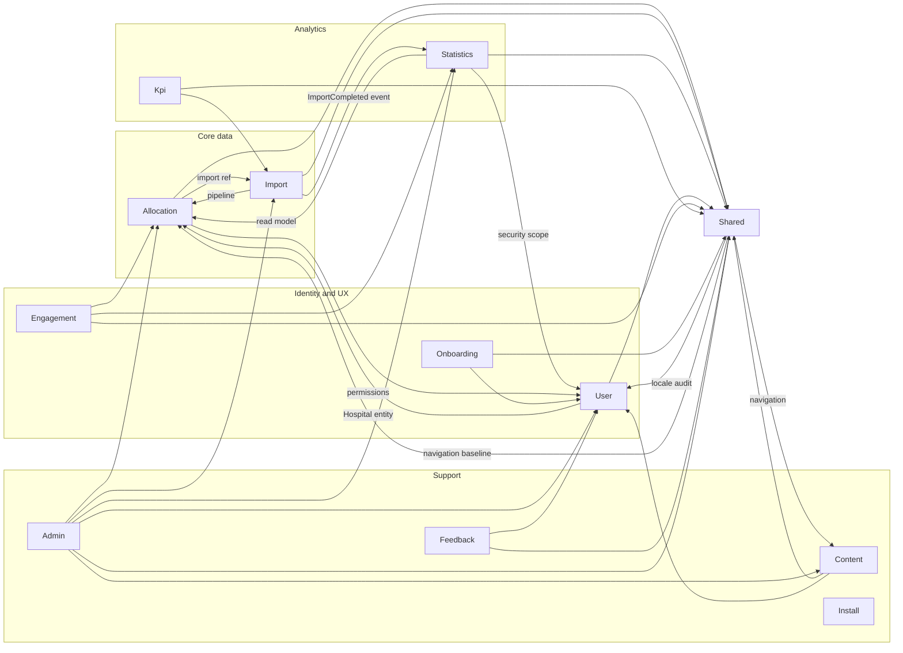

# Dependency rules

**Status:** accepted (Phase 2 — approved 2026-07-13)  
**Related:** [target-architecture.md](target-architecture.md), [ADR 009](decisions/009-cross-context-dependency-rules.md)

This document defines **allowed dependency directions** between bounded contexts and modules. It is an Ist-informed **target** for Deptrac (Phase 3).

## Context map

## Rule matrix

Legend: **allowed** | **restricted** | **forbidden** | **exception**

| From → To | Status | Mechanism | Notes |
|-----------|--------|-----------|-------|
| Any BC → Shared | allowed | Application/Infrastructure imports | Shared is downstream of all BCs |
| Shared → any BC | restricted | Only Application types or Symfony contracts | Must not import `*/Infrastructure/*` of foreign BCs (ARCH-005) |
| Import → Allocation | allowed | Entities, repositories, resolvers | Core import pipeline |
| Allocation → Import | restricted | `Import` entity on `Allocation` only | `src/Allocation/Domain/Entity/Allocation.php` |
| Import → Statistics | allowed | Application event → Messenger message | `ImportCompletedSubscriber` |
| Statistics → Allocation | allowed | Entities, queries, projection | Read-only; no writes to Allocation domain |
| Statistics → User | allowed | Security, user scope, roles | Broad but intentional |
| Allocation → User | allowed | Security, permissions, voters | `HospitalPermissionAccess` |
| User → Allocation | restricted | `Hospital` entity only | `src/User/Domain/Entity/User.php` (ARCH-003) |
| Engagement → Allocation | allowed | Hospital lists, participation | Monthly reminders |
| Engagement → Statistics | allowed | Chart/metric data | Read-only analytics |
| Kpi → Import | allowed | Import failure metrics | `FailedImportRowDto` |
| Content → User | allowed | Auth, authorship | |
| Onboarding → User | allowed | Progress per user | |
| Feedback → User | allowed | Spam logging, auth | |
| Any BC → Admin | forbidden | — | Admin is a leaf module |
| Any BC → Install | forbidden | — | Install is a leaf module |
| Admin → any BC | exception | CRUD controllers | Technical module; not a pattern for features (ADR 009) |
| Statistics submodule → Statistics submodule | allowed | Direct imports within `src/Statistics/**` | ADR 011 |
| Statistics submodule → foreign BC | restricted | Same rules as Statistics root | No extra permissions |
| DataFixtures → any | exception | Dev/test only | Excluded from production Deptrac rules |

## Rules in natural language (Deptrac candidates)

### R1 — Shared isolation

**Shared must not depend on foreign bounded context Infrastructure.**

- Target: `App\Shared\**` may not use `App\{Allocation,Import,Statistics,…}\Infrastructure\**`
- Baseline violation: ~~`SitemapProvider` imports `ExportVoter`~~ — resolved (MC-1)
- Remediation: MC-1 — use `AuthorizationCheckerInterface::isGranted()`

### R2 — Import and Allocation pipeline

**Import may use Allocation Domain and Infrastructure. Allocation may reference Import Domain entity `Import` only.**

- Evidence: 44 Import files import Allocation; `Allocation.import` ManyToOne
- Status: allowed / restricted respectively

### R3 — Statistics read path

**Statistics may read Allocation and User. Statistics must not mutate Allocation aggregate state.**

- Evidence: `AllocationStatsProjectionRebuilder`, `StatisticsFilterFactory`, hospital scope resolvers
- Writes go to Statistics-owned projection/MV tables (ADR 001)

### R4 — User and Hospital

**User Domain may reference `Allocation\Domain\Entity\Hospital` only — no other Allocation types in Domain.**

- Evidence: `User.php` hospital relation
- Alternative (deferred): hospital ID as scalar — breaking change

### R5 — No upward dependency on technical modules

**No bounded context imports Admin or Install.**

- Evidence: zero production imports in Ist analysis

### R6 — Admin exception

**Admin may import any context for CRUD purposes.**

- Evidence: `src/Admin/UI/Http/Controller/**` — 34 controllers
- Not a template for feature development

### R7 — Statistics internal modules

**Code under `src/Statistics/{Submodule}/**` may import other Statistics submodules and Statistics root layers directly.**

- Must not add new foreign BC dependencies beyond those allowed for Statistics (Allocation, User, Shared)
- See [ADR 011](decisions/011-statistics-internal-modules.md)

### R8 — Layer direction within a context

**Within one BC: UI → Application → Domain; Infrastructure implements persistence; Domain must not depend on UI.**

- Exception: `repositoryClass` attribute on entities (ADR 007)
- Exception: Audit attributes from Shared Infrastructure on domain entities

### R9 — UI and persistence

**UI controllers must not inject `EntityManagerInterface` (new code).**

- Baseline exceptions (5 controllers): listed in [target-architecture.md](target-architecture.md#known-baseline-violations-phase-3-input)

### R10 — Messenger and integration events

**Message handlers live in Application. Handlers may dispatch integration events (`Application/Event/`) and Messenger messages. Handlers must not render UI.**

- Evidence: `ImportAllocationsMessageHandler`, `RebuildAllocationStatsProjectionHandler`

### R11 — Domain events for significant state changes

**After significant successful domain writes, dispatch a domain event from `Domain/Event/` (past-tense name) via an application service. Cross-context reactions use integration events or Messenger — not direct foreign infrastructure.**

- Target examples: `HospitalCreated`, `HospitalAccessGrantCreated`
- Current gap: few `Domain/Event/` classes exist; `ImportCompleted` / `UserRegistered` remain integration events (ADR 012)
- Listeners in the same BC may subscribe in Infrastructure; other BCs consume via integration layer

## Cross-context coupling strength (Ist reference)

File counts with cross-context `use` statements (Phase 1 analysis):

| Edge | Files | Assessment |
|------|-------|------------|
| Statistics → User | 60 | High but expected (security) |
| Allocation → User | 51 | High but expected (permissions) |
| Import → Allocation | 44 | Core pipeline |
| Statistics → Allocation | 40 | Read model |
| Allocation → Shared | 36 | Export, audit, public IDs |
| Shared → User | 19 | Locale, audit |
| Admin → Allocation | 18 | CRUD exception |

## Phase 1 finding references

| Rule | ARCH ID |
|------|---------|
| AllocationRepository size | ARCH-001 |
| Statistics complexity | ARCH-002 |
| User → Hospital | ARCH-003 |
| repositoryClass in Domain | ARCH-004 |
| Shared → ExportVoter | ARCH-005 |
| No repository interfaces | ARCH-006 |
| Contract naming | ARCH-007 |
| EntityManager in controllers | ARCH-008 |
| No Deptrac yet | ARCH-009 |
| Application events | ARCH-010 |
| Domain events (target) | ADR 012 |
| Projection entities in Infrastructure | ARCH-011 |
| Engagement in Kpi scheduler | ARCH-012 |

## Related documents

- [target-architecture.md](target-architecture.md) — layer rules and exceptions
- [data-flow.md](data-flow.md) — Import → Statistics pipeline
- [decisions/009-cross-context-dependency-rules.md](decisions/009-cross-context-dependency-rules.md) — ADR
