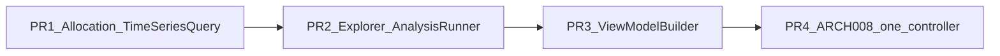

# Refactoring backlog (Phase 5)

**Related:** [complexity-analysis.md](complexity-analysis.md), [target-architecture.md](target-architecture.md), [deptrac.md](deptrac.md)

Ordered backlog for **Phase 5: stepwise refactorings**. Rule: **one hotspot per PR**, tests first, `make deptrac` + `make test` after each step.

## Priority legend

| Priority | Meaning |
|----------|---------|
| **P1** | High beta risk + high CRAP/LOC; blocks maintainability |
| **P2** | Significant duplication or structure debt |
| **P3** | Smaller wins or architecture-only |
| **P-Arch** | Layer violation, not size |

## Backlog

| Rank | Hotspot | ARCH | Evidence (Phase 4) | Strategy (smallest step) | Effort | Deptrac impact |
|------|---------|------|-------------------|--------------------------|--------|----------------|
| 1 | `AllocationRepository` | ARCH-001 | 1 862 LOC, sum CRAP 1 098, 10.2 % lines, 14 churn commits | Extract `AllocationTimeSeriesQuery` (+ scope helper); delegate from repository | large | Medium (Application→Infra) |
| 2 | `AnalysisExplorerShell` | ARCH-002 | 897 LOC, sum CRAP 242, 14 churn commits | Extract `ExplorerAnalysisRunner` to Application | large | UI/Application split |
| 3 | `ProjectionTimeSeriesQuery` | ARCH-002 | 482 LOC, sum CRAP 271, 43 % coverage | Extract first bucket sub-query class | medium | Low |
| 4 | `ExplorerConfigMapper` | ARCH-002 | 657 LOC, sum CRAP 123 | Extract `ExplorerConfigUpgrader` for legacy versions | medium | Low |
| 5 | `ExplorerEditFormType` | ARCH-002 | 722 LOC, sum CRAP 92 | Split into partial form types by drawer section | medium | Low |
| 6 | ViewModel factories (2×) | ARCH-002 | ~585 LOC each, ccn 30, duplicated logic | Introduce `StatisticsScopeViewModelBuilder` | medium | Low |
| 7 | `ExplorerResultsTablePresenter` | ARCH-002 | 566 LOC, sum CRAP 104 | Separate export builder from table presentation | medium | Low |
| 8 | `BenchmarkMetricBuilder` | ARCH-002 | 490 LOC | Extract metric calculators per benchmark type | medium | Low |
| 9 | `MonthlyReminderContentBuilder` | — | 483 LOC, 13 deps | Narrow to `MonthlyReminderMetricsProviderInterface` (Statistics contract) | medium | Cross-BC |
| 10 | `DimensionRegistry` | ARCH-002 | 504 LOC, **business** complexity | Optional: split dimension defs into tagged providers (only if needed) | large | Low |
| 11 | ARCH-008 controllers (5×) | ARCH-008 | EntityManager in UI | One controller → application service per PR | small each | Baseline −1 per controller |
| 12 | `Kpi_Application` → `Admin_UI` | ADR 009 | 7 baseline skips | `AdminLinkGeneratorInterface` for KPI dashboard links | small | Baseline −7 |
| 13 | `Allocation` entity | — | 531 LOC, business | Defer — fat entity acceptable without logic mix | — | — |

## Suggested PR sequence

1. **PR 1** — `AllocationRepository`: first query extraction + tests (highest CRAP × low coverage).  
2. **PR 2** — `AnalysisExplorerShell`: `ExplorerAnalysisRunner`.  
3. **PR 3** — Shared `StatisticsScopeViewModelBuilder` (low regression risk, high duplication win).  
4. **PR 4** — One ARCH-008 controller (e.g. `SettingsController`).  
5. Continue down the table; re-run `make complexity` after every 2–3 PRs to verify CRAP/coverage trends.

## Success metrics (Phase 5)

| Target | Before (Phase 4) | Goal |
|--------|------------------|------|
| `AllocationRepository` LOC | 1 862 | &lt; 400 (long-term; incremental) |
| `AllocationRepository` line coverage | 10.2 % | &gt; 50 % on extracted queries |
| `AnalysisExplorerShell` LOC | 897 | &lt; 300 (long-term) |
| Deptrac baseline skips | 390 | Decrease; no new skips |
| ARCH-008 controllers | 5 | 0 |

## Out of scope (separate backlog)

- Analysis Explorer dashboard deduplication ([analysis-explorer-library-standards.md](../04-features/statistics/analysis-explorer-library-standards.md) Phase 2)
- Full Deptrac CI fail (`continue-on-error` removal)
- ARCH-004 / `repositoryClass` migration
